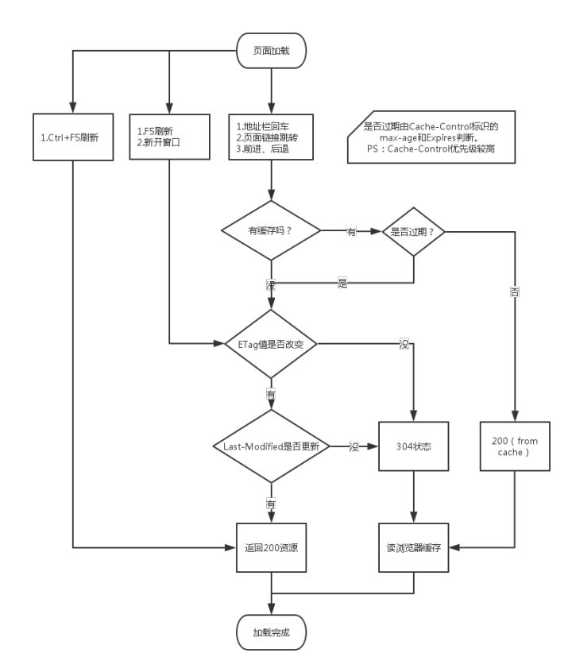
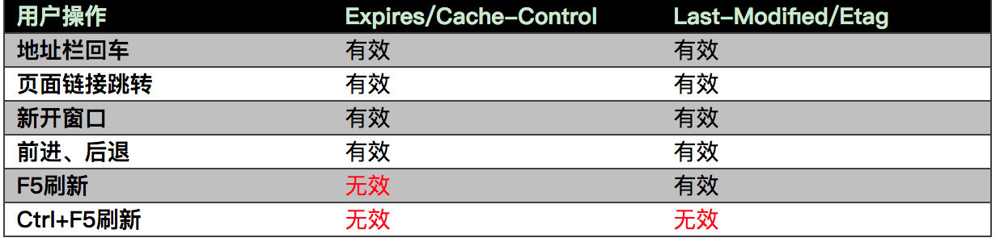

## 浏览器的缓存机制
## 两个概念
### 强缓存
直接从客户端缓存中获取，不与服务器发生交互行为
### 协商缓存
由服务器判断是否从缓存中获取资源

## 四个过程
* 浏览器判定是否有缓存
* 缓存是否过期
* 与服务器协商是否使用缓存
* 协商缓存

## from disk cache和from memory cache有什么区别
* from disk cache 从磁盘中获取，只能缓存派生资源
* from memory cache 从内存中获取，只能缓存派生资源，退出进程数据会被清空
### 浏览器以什么规则区分disk cahce，还是memory cache
有可能是根据memory的空闲状态，这个跟浏览器的机制相关，还未有准确的答案

## 状态码200和304
304：访问服务器，发现数据没有更新，返回该状态码，从缓存中读取数据

## 字段解析
> 验证顺序Cache-Control > expires > Etag > Last-modified
* expires
  Http1.0中的标准，表明过期时间，该时间为客户端时间
* Cache-Control
  Http1.1中的标准，是expires的补充，使用相对时间
  1. max-age，设置缓存的最大有效时间，会覆盖Expires
  2. s-maxage，用于共享缓存，会覆盖max-age和Expires
  3. public，响应会被缓存，并且在多用户间共享，默认是public
  4. private，响应会被缓存，不能再多用户间共享，如果要求HTTP认证，默认是private
  5. no-cache，指定不缓存响应，表明资源不进行缓存。但是设置了no-cache之后并不代表浏览器不缓存，而是在缓存前要向服务器确认资源是否被更改。因此有的时候只设置no-cache防止缓存还是不够保险，还可以加上private指令，将过期时间设为过去的时间（max-age=0）。
  6. no-store，绝对禁止缓存
  7. must-revalidate，如果页面过期，则去服务器进行获取
* Last-modified，表明请求的资源上次的修改时间
* If-Modified-Since，客户端保留的资源上次的修改时间。
* Etag，资源的内容标识
* If-None-Match，客户端保留的资源内容标识

## 缓存设置
* 知乎: 
  private,no-store,max-age=0,no-cache,must-revalidate,post-check=0,pre-check=0
  expires:Fri, 02 Jan 2000 00:00:00 GMT
* 淘宝:
  cache-control:max-age=60
* 天猫:
  cache-control:max-age=0, s-maxage=60
* 饿了吗
  cache-control:max-age=60

## HTTP Meta标签
<META HTTP-EQUIV="Pragma" CONTENT="no-cache">
告诉浏览器当前页面不被缓存，每次访问都需要去服务器拉取，但是只有部分浏览器支持，而且所有的代理服务器都不支持，因为代理服务器不解析HTML内容本身

## 三级缓存
* 先去内存看，有，直接加载
* 再去磁盘看，有，直接加载
* 进行网络请求，200，缓存资源，304，从缓存中获取

## 分布式系统
## 负载均衡

## 用户行为与缓存
用户操作 | Cache-Control/Expires | Etag/Last-Modified
- | - | -
地址栏回车 | 有效 | 有效
页面链接跳转 | 有效 | 有效
新开窗口 | 有效 | 有效
前进、后退 | 有效 | 有效
F5刷新 | 无效（重置max-age=0）| 有效
Ctrl+F5刷新 | 无效（重置Cache-Control=no-cache）| 无效（请求头丢弃该选项）

## 相关图片

## 知乎精彩回答
浏览器缓存控制分为强缓存和协商缓存，协商缓存必须配合强缓存使用。 

首先浏览器第一次跟服务器请求一个资源，服务器在返回这个资源和response header的同时，会根据开发者要求或者浏览器默认，在response的header加上相关字段的http response header。

一、当浏览器对某个资源的请求命中了强缓存时，利用[Expires]或者[Cache-Control]这两个http response header实现
。

1. [Expires]：描述的是一个绝对时间，根据的是客户端时间。用GMT格式的字符串表示，如：Expires:Thu, 31 Dec 2037 23:55:55 GMT 下次浏览器再次请求同一资源时。先从客户端缓存中寻找，找到这个资源后，拿出它的[Expires]跟当前的请求时间比较。如果请求时间在[Expires]指定的失效时间之前，就能命中缓存，这样就不用再次到服务器上去缓存一遍，节省了资源。但是正因为是绝对时间，如果客户端时间被随意更改下，这个机制就失效了。所以我们需要[Cache-Control]。

2. [Cache-Control]：描述的是一个相对时间，在进行缓存命中时，都是利用浏览器时间判断。

这两个header可以只启用一个，也可以同时启用，当response header中，[Expires]和[Cache-Control]同时存在时，[Cache-Control]优先级高于[Expires]。

二、当浏览器对某个资源的请求没有命中强缓存，就会发一个请求到服务器，验证协商缓存是否命中。
如果命中，则还是从客户端缓存中加载。协商缓存利用的是[Last-Modified，If-Modified-Since]和[ETag、If-None-Match]这两对Header来管理的。 

1. [Last-Modified]：原理和上面的[expires]相同，区别是它是根据服务器时间返回的header来判断缓存是否存在。但是有时候也会服务器上资源其实有变化，但是最后修改时间却没有变化的情况（这种问题也不容易被定位），这时候我们需要[ETag、If-None-Match]。

2. [ETag、If-None-Match]：原理与上相同，区别是浏览器跟服务器请求一个资源，服务器在返回这个资源的同时，在respone的header加上ETag的header，这个header是服务器根据当前请求的资源生成的一个唯一标识，这个唯一标识是一个字符串，只要资源有变化这个串就不同。

3. [ETag、If-None-Match]这么厉害我们为什么还需要[Last-Modified、If-Modified-Since]呢？有一个例子就是分布式系统尽量关闭掉ETag(每台机器生成的ETag都会不一样）

[Last-Modified，If-Modified-Since]和[ETag、If-None-Match]一般都是同时启用。
